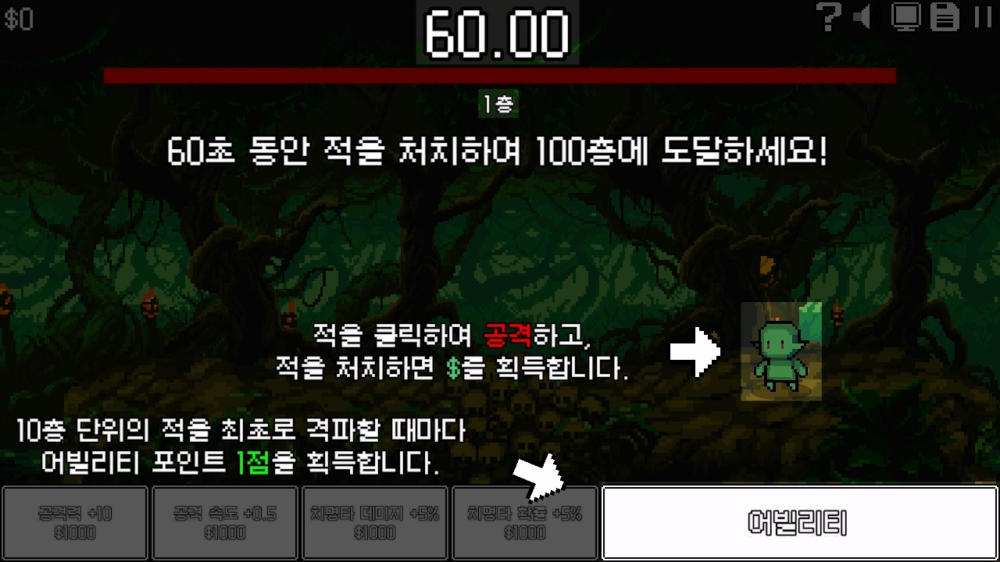
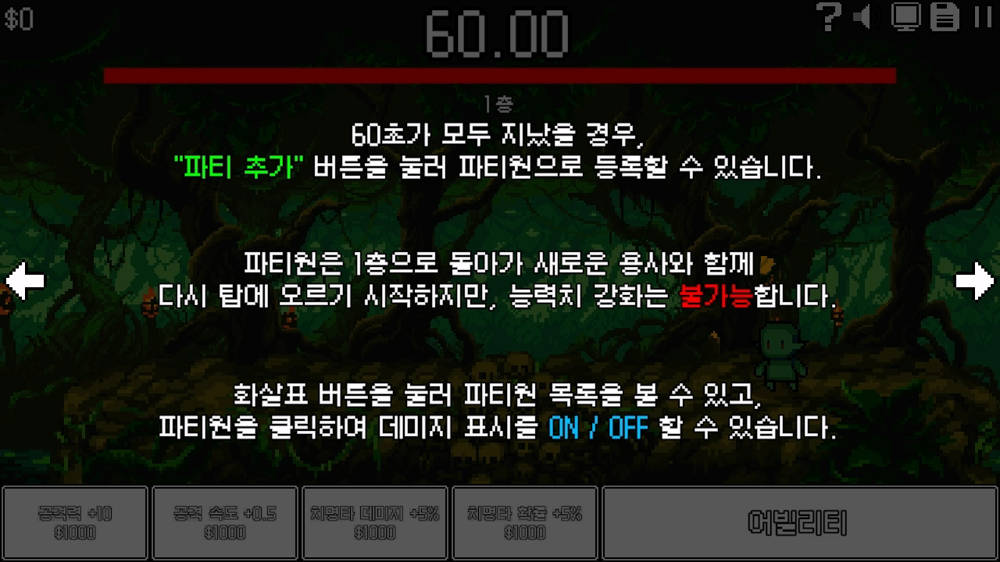
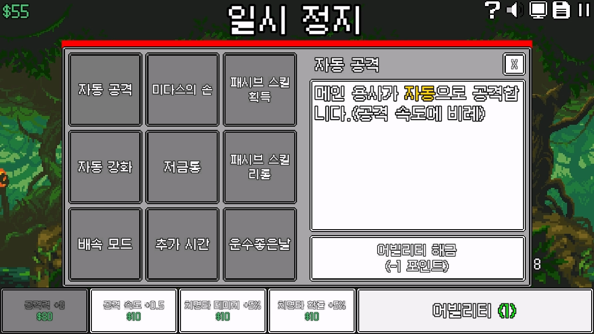
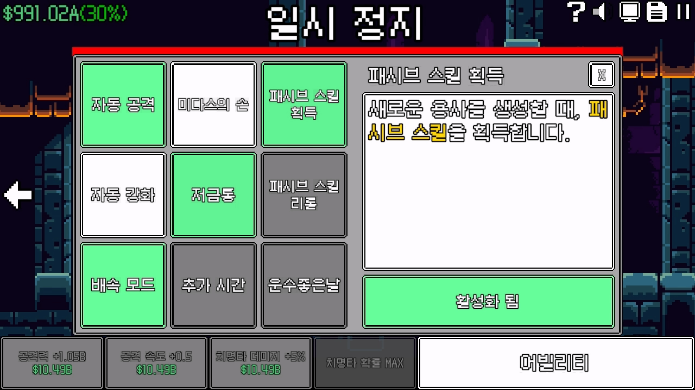
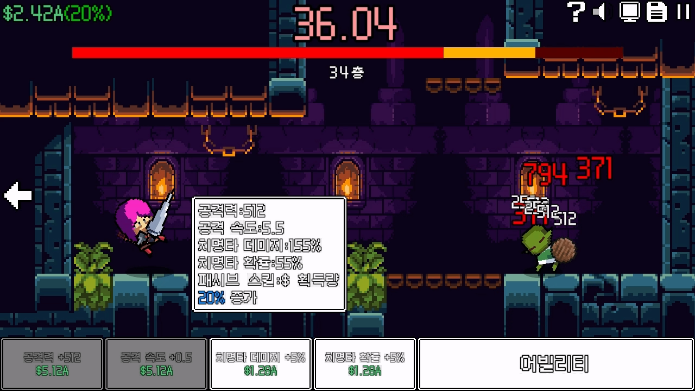
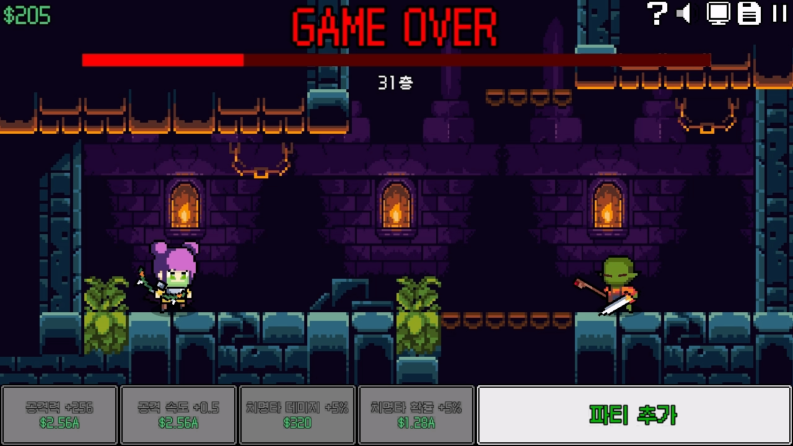
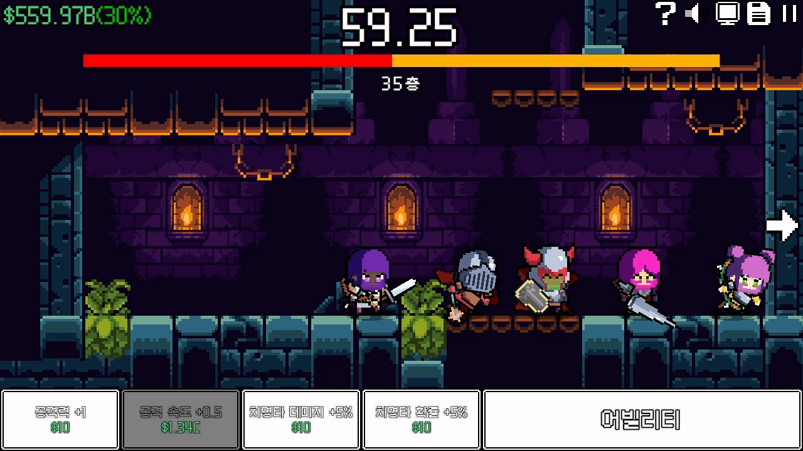

# 🎮 60초 용사 - Unity 2D 방치형 클리커 게임


---

## 📚 목차

- [🧾 개요](#-개요)
- [🎬 게임 플레이 영상](#-게임-플레이-영상)
- [📸 대표 스크린샷](#-대표-스크린샷)
- [🛠 기술 스택](#-기술-스택)
- [🧩 시스템 구성 요약](#-시스템-구성-요약)
- [🧠 기술 포인트](#-기술-포인트)
- [📁 폴더 구조](#-폴더-구조)
- [📎 관련 링크 모음](#-관련-링크-모음)

---

## 🧾 개요

**60초 용사**는 픽셀 아트 스타일의 **방치형 클리커 게임**입니다.

본 저장소는 게임의 클라이언트 기능 중 강화 / 패시브 / 저장 / 옵션 설정 등의 시스템을 모듈 단위로 정리한 기술 포트폴리오입니다.

> 📌 이 게임은 인디게임 커뮤니티 ‘만들래’에서 열린 공모전에서 4위를 수상했습니다.
> 
- **플랫폼**: Window PC
- **개발 기간**: 2025.02.11 ~ 2025.02.27 (약 2주)
- **개발 인원**: 김경나(기획), 나윤재(개발)
- **주요 역할**: Unity 기반 클라이언트 설계 및 구현

---

## 🎬 게임 플레이 영상

> 아래 이미지를 클릭하면 유튜브에서 플레이 영상을 볼 수 있습니다.

<p align="center">
  <a href="https://www.youtube.com/watch?v=0YsCDdN3RmY">
    
  </a>
</p>

---

## 📸 대표 스크린샷

<p align="center">
  
  
</p>

<br>

<details>
  <summary>📖 튜토리얼</summary>

  <p align="center">
    
    
  </p>
</details>

<details>
  <summary>💥 어빌리티</summary>

  <p align="center">
    
    
  </p>
</details>

<details>
  <summary>📊 패시브 & 캐릭터 스탯</summary>

  <p align="center">
    
    
  </p>
</details>

<details>
  <summary>🧙 게임 오버 & 파티</summary>

  <p align="center">
    
    
  </p>
</details>

---

## 🛠 기술 스택

| 항목       | 내용                                              |
|------------|---------------------------------------------------|
| **엔진**   | Unity - 6000.0.34f1                                  |
| **언어**   | C#                                                |
| **저장**   | JsonUtility, AES 암호화, PlayerPrefs              |
| **애니메이션** | DOTween (버튼, 텍스트, 연출 등 효과)          |
| **UI/UX**  | TextMeshPro, Canvas 기반 UI 설계 및 연출          |

---

## 🧩 시스템 구성 요약

### 🔹 강화 시스템
- 공격력, 공격 속도, 치명타 관련 능력 강화
- 자동 강화 기능 (조건 충족 시 비용 낮은 능력부터 자동 강화)

### 🔹 패시브 시스템
- 패시브 10종 + 희귀도 3단계 시스템
- 능력 해금/활성화 조건 존재
- 패시브별 전투/버프/경제 기능 구현

### 🔹 저장 시스템
- AES 기반 암호화 + JsonUtility 저장 구조
- 게임 종료/저장 버튼 클릭 시 자동 저장 처리

### 🔹 옵션 UI
- 해상도 및 전체화면 설정 (16:9 고정)
- 볼륨 설정 (BGM/SFX 각각 버튼으로 조절)

### 🔹 기타 기능
- 유닛 생성 시 패시브 선택
- 파티원 수 증가에 따른 화면 스크롤 이동
- 게임 속도 변경 기능 (배속 모드)

---

## 🧠 기술 포인트

| 항목             | 설명                                                           |
|------------------|----------------------------------------------------------------|
| 🎯 구조 설계     | GameManager 중심의 상태 관리, 기능별 폴더 구조 분리           |
| 💾 저장 처리     | JsonUtility + AES 암호화 + PlayerPrefs를 통한 안전한 데이터 처리 |
| ⬆️ 자동화 연출   | 강화 시 DOTween으로 업그레이드 효과 및 텍스트 출력             |
| 🧠 패시브 반영   | 희귀도 별 능력치 적용 및 조건 기반 해금/활성화 시스템 구현     |
| 🔧 UI 구조       | 버튼 기반 설정 및 패널 분기, 해상도/사운드 등 실시간 반영     |
| 🔍 가독성 개선   | NumberFormatter로 숫자 시각화 / UI 스타일 통일                 |

---

## 📁 폴더 구조

```
60Second_Hero/
├── Scripts/
│ ├── Ability_System/   # 패시브, 파티, 능력 해금 시스템
│ ├── Save_System/      # 저장 및 암호화 유틸리티
│ ├── UI_UX_System/     # 해상도, 사운드, 메뉴 버튼, 튜토리얼 등 UI
│ ├── Upgrade_System/   # 강화 버튼, 비용 계산, 강화 효과 처리
│ └── GameControl/      # GameManager, Enemy, Player 등 주요 게임 제어
├── Src/                # 스크린샷, 썸네일, 영상 등 리소스
└── README.md
```

---

## 📎 관련 링크 모음

- 🎮 **게임 다운로드**  
  👉 [다운로드 페이지 바로가기](https://mandlemandle.com/project/c07899/game?contest=10%EB%B6%84%EA%B2%8C%EC%9E%84%EB%B0%A9%EC%B9%98%ED%8E%B8)   

- 📚 **기술 문서 보기**  
  👉 [문서 PDF 바로가기](https://github.com/BSF0124)   
  
- ✍️ **개발 후기 및 기술 소개 (velog)**  
  👉 [Velog 글 읽기](https://velog.io/@dbsdbds4532)
